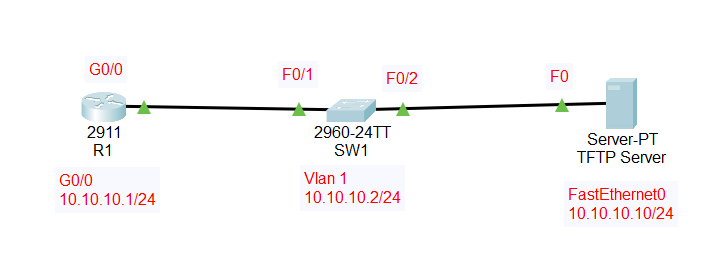

# Router & Switch Recovery + IOS Lifecycle Lab

## Overview

NOC-style walkthrough covering factory reset, config persistence, password recovery, config + IOS backups, ROMMON IOS recovery (TFTP), and switch IOS upgrade. Evidence files are linked under each step.

---
## Environment
- Router: Cisco 2911 (IOS 15.1(4)M4)
- Switch: Catalyst 2960 (12.2(25)FX → 15.0(2)SE4)
- TFTP Server: 10.10.10.10
- Router LAN: 10.10.10.0/24 (R1 G0/0 = 10.10.10.1)
---
## Topology

---
## Step 1: Pre-Reset Configuration Check
### Goal
Confirm hostname + interface config exist before reset
  
### Commands
- `show running-config`

### Evidence
- [show-running-config.txt](../Evidence/incident-002-show-running-config.txt)
---
## Step 2 : Factory Reset + Baseline Verification
### Goal
Erase configuration, reboot, exit setup wizard, confirm configs are empty.

### Evidence
- [baseline-after-reset.txt](../Evidence/incident-002-baseline-after-reset.txt)
- [show-startup-config.txt](../Evidence/incident-002-show-startup-config.txt)

---

## Step 3 : Configuration Restore + Save to NVRAM
### Goal
Paste baseline config and save to startup-config.

### Key Commands
- `configure terminal`
- `hostname R1`
- `interface g0/0`
- `ip address 10.10.10.1 255.255.255.0`
- `no shutdown`
- `copy running-config startup-config`

### Evidence
- [config-restore.txt](../Evidence/incident-002-config-restore.txt)

---

## Step 4 (Q6): Set Enable Secret + Save
### Goal
Configure enable secret and save.

### Evidence
- [enable-secret-set.txt](../Evidence/enable-secret-set.txt)

---

## Step 5 (Q7–Q16): Password Recovery Workflow
### Goal
Boot ignoring startup-config, restore config to running, remove enable secret, return to normal boot, verify.

### Evidence
- [rommon-confreg-0242.txt](../Evidence/rommon-confreg-0242.txt)
- [expected-running-startup.txt](../Evidence/expected-running-startup.txt)
- [restore-startup-to-running.txt](../Evidence/restore-startup-to-running.txt)
- [g0-0-down.txt](../Evidence/g0-0-down.txt)
- [g0-0-up.txt](../Evidence/g0-0-up.txt)
- [remove-enable-secret.txt](../Evidence/remove-enable-secret.txt)
- [config-register-02102.txt](../Evidence/config-register-02102.txt)
- [post-reload-verify.txt](../Evidence/post-reload-verify.txt)

---

## Step 6 (Q17–Q19): Backup Running/Startup Config + IOS Image
### Goal
Back up configs and IOS before destructive actions.

### Evidence
- [running-config-to-flash.txt](../Evidence/running-config-to-flash.txt)
- [startup-config-to-tftp.txt](../Evidence/startup-config-to-tftp.txt)
- [ios-image-to-tftp.txt](../Evidence/ios-image-to-tftp.txt)

---

## Step 7 (Q20–Q21): Delete IOS + ROMMON Recovery (TFTP)
### Goal
Delete IOS, enter ROMMON, set variables, recover IOS from TFTP, verify.

### Evidence
- [delete-ios-show-flash.txt](../Evidence/delete-ios-show-flash.txt)
- [rommon-variables.txt](../Evidence/rommon-variables.txt)
- [router-ios-recovered-show-version.txt](../Evidence/router-ios-recovered-show-version.txt)

---

## Step 8 (Q22–Q24): Switch IOS Upgrade + Verification
### Goal
Verify old switch IOS, upgrade via TFTP, reload, verify new IOS.

### Evidence
- [switch-old-show-version.txt](../Evidence/switch-old-show-version.txt)
- [switch-copy-ios-from-tftp.txt](../Evidence/switch-copy-ios-from-tftp.txt)
- [switch-new-show-version.txt](../Evidence/switch-new-show-version.txt)

---

## Validation Summary
- Startup-config confirmed empty after factory reset (baseline verified)
- Configuration restored and persisted across reload
- Password recovery completed and normal boot restored (0x2102)
- Running/startup configs backed up + IOS image backed up to TFTP
- Router IOS successfully recovered via ROMMON + TFTP
- Switch IOS successfully upgraded and verified with `show version`
  
